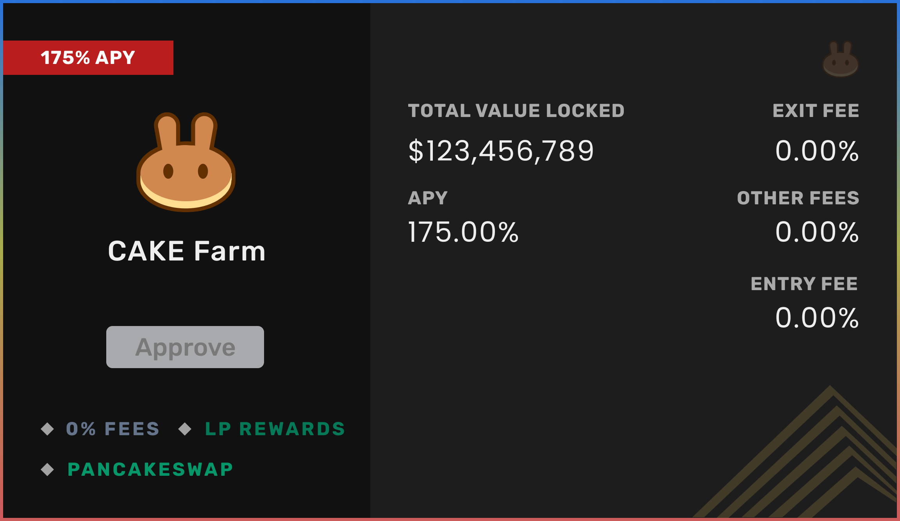

# Cake Farm

The cake farm is a part of the NEP pool. This contract farms CAKE in PancakeSwap and rewards users with NEP tokens. Check `nep-pool` repository for more info.

In the CAKE farm, the deposited assets are farmed in the Syrup pool and the obtained CAKE reward will be used to purchase NEP tokens in the PancakeSwap exchange. The obtained NEP rewards will be burned thereby reducing the total supply.
